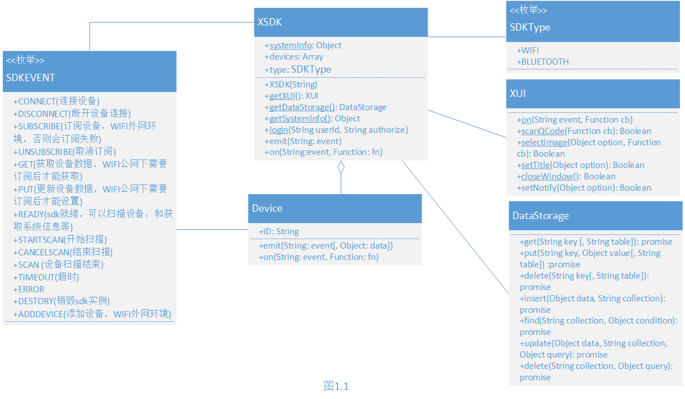
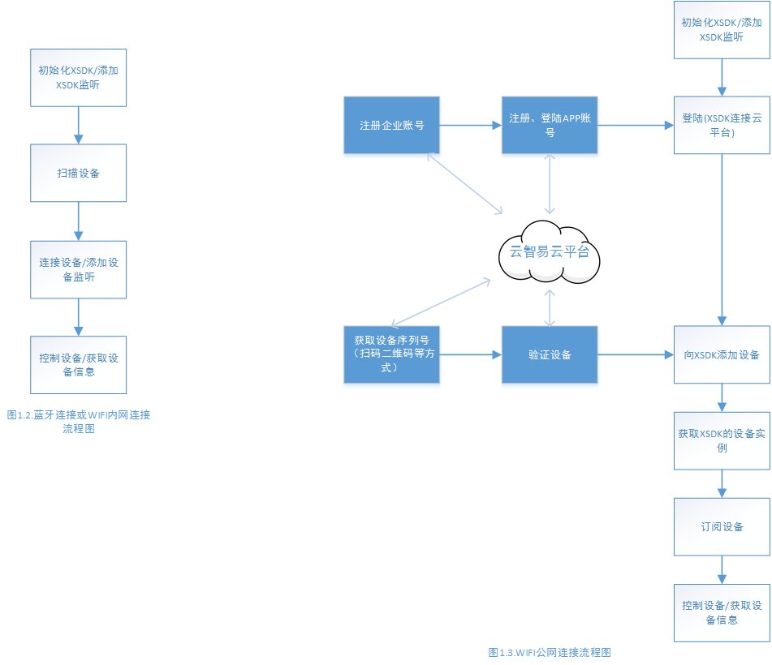

# JS SDK 接口文档 #
云智易为H5开发提供了跨平台(android ios)的容器接口JS SDK(以下简称JS SDK)，支持WIFI和蓝牙模式连接。


- [概述](#overview)
- [安装方法](#installation)
- [代码示例](#example)
- [接口文档](#document)

## <a name='overview'>概述</a> ##
该文档描述了JS SDK的安装和使用方法。包括简单的代码示例
JS SDK提供了4个类:[XSDK](#xsdk)，[Device](#device), [XUI](#xui), [DataStorage](#dataStorage)。图1.1是JS SDK的UML类图


> *蓝牙和WIFI内网环境下*，初始化XSDK和连接控制设备流程如图1.2，[代码示例](#code1)
> *WIFI公网环境下*，初始化XSDK和连接控制设备流程如图1.3，[代码示例](#code2)

## <a name='installation'>安装方法</a> ##
## <a name='example'>代码示例</a> ##
## <a name='document'>接口文档</a> ##
### <a name='xsdk'>Class XSDK</a> ###
JS SDK 在window下暴露了一个全局的XSDK类，根据构造函数参数，返回不同的连接实例，每个连接（蓝牙或者WIFI）只维护一个实例。XSDK还提供包括([UI](#xui) [数据存储](#dataStorage))等静态方法。

#### 属性 ####
| 修饰符和类型 | 属性和描述 |
|--------------|------------|
| String | sdkType (实例的类型，蓝牙或者WIFI) |
| Array | devices (Device类型数组) |
| static Object | systemInfo (操作系统和容器信息) |
| [XUI](#xui) | ui (UI相关操作类，例如关闭窗口，扫描二维码) |
| [DataStorage](#dataStorage) | dataStorage (数据存储) |

#### 构造函数 ####
| 构造函数和描述 |
|------------|
| XSDK (String type) <br/>参数：type-设备类型[SDKType](#sdkType)的一种|

#### 方法 ####
| 修饰符和类型 | 方法和描述 |
|--------------|------------|
| void | emit (String event) (触发事件) <br/> 参数: event-支持的发送事件有[STARTSCAN](#STARTSCAN) [CANCELSCAN](#CANCELSCAN) [DESTORY](#DESTORY)|
| void | on (String event, Function cb) (监听事件) <br/>参数： event-支持的监听事件有[READY](#READY) [SCAN](#DISCONNECT) [DATA](#DATA) [STATUSCHANGE](#STATUSCHANGE) [TIMEOUT](#TIMEOUT) [ERROR](#ERROR) <br/> &#8195;&#8195;&#8195; cb-监听事件的回调函数|

### <a name='device'>Class Device</a> ###
Device类表示设备。每一个Device实例根据设备id(device_id)唯一关联一个设备。
#### 属性 ####
| 修饰符和类型 | 属性和描述 |
|--------------|------------|
| String | id (设备id) |

#### 构造函数 ####
| 修饰符和类型 | 构造函数和描述 |
|--------------|------------|
| [Device](#device) | Device(String id) (返回设备实例) <br/> 参数：id-设备id|

#### 方法 ####
| 修饰符和类型 | 方法和描述 |
|--------------|------------|
| void | emit (String event[, String data]) (触发事件) <br/> 参数： event-支持的发送事件有[CONNECT](#CONNECT) [DISCONNECT](#DISCONNECT) [GET](#GET) [PUT](#PUT)<br/>&#8195;&#8195;&#8195; data-仅在事件为[PUT](#PUT)时添加|
| void | on (String event, Function cb) (监听事件) <br/>参数： event-支持的监听事件有[CONNECT](#CONNECT) [DISCONNECT](#DISCONNECT) [DATA](#DATA) [TIMEOUT](#TIMEOUT) [ERROR](#ERROR) <br/> &#8195;&#8195;&#8195; cb-监听事件的回调函数|

### Class SDKEvent ###
#### 属性 ####
| 修饰符和类型 | 属性和描述 |
|--------------|------------|
| const String | <a name='CONNECT'>CONNECT</a> (连接设备) |
| const String | <a name='DISCONNECT'>DISCONNECT</a> (断开设备连接) |
| const String | <a name='DATA'>DATA</a> (设备数据更新) |
| const String | <a name='SUBSCRIBE'>SUBSCRIBE</a> (订阅设备) |
| const String | <a name='UNSUBSCRIBE'>UNSUBSCRIBE</a> (取消订阅设备) |
| const String | <a name='GET'>GET</a> (获取设备数据) |
| const String | <a name='PUT'>PUT</a> (设置设备数据) |
| const String | <a name='READY'>READY</a> (SDK 就绪，可以扫描设备) |
| const String | <a name='STATUSCHANGE'>STATUSCHANGE</a> (SDK 状态，即蓝牙和WIFI状态改变事件) |
| const String | <a name='STARTSCAN'>STARTSCAN</a> (开始扫描设备) |
| const String | <a name='CANCELSCAN'>CANCELSCAN</a> (取消扫描设备) |
| const String | <a name='SCAN'>SCAN</a> (扫描设备完成) |
| const String | <a name='DESTORY'>DESTORY</a> (销毁一个连接实例) |
| const String | <a name='TIMEOUT'>TIMEOUT</a> (超时) |
| const String | <a name='UIBACK'>UIBACK</a> (android系统的后退按钮事件) |
| const String | <a name='ERROR'>ERROR</a> |

### <a name='sdkType'>Class SDKType</a> ###
#### 属性 ####
| 修饰符和类型 | 属性和描述 |
|--------------|------------|
| const String | WIFI |
| const String | BLUETOOTH |

### <a name='xui'>Class XUI</a> ###
#### 方法 ####
| 修饰符和类型 | 方法和描述 |
|--------------|------------|
| static void | on(SDKEvent event) (监听UI事件)<br/>参数：event-支持的事件有[UIBACK](#UIBACK) |
| staitc Boolean | [scanQCode](#scanQCode)(Function cb) (扫描二维码)|
| staitc Boolean | [selectImage](#selectImage)(Object option, function cb) (选择手机相册图片)|
| staitc Boolean | [setTitleBar](#setTitleBar)(Object option) (设置标题栏)|
| staitc Boolean | [closeWindow](#closeWindow)() (关闭窗口)|
| staitc Boolean | [setNotify](#setNotify)(Object option) (设置通知栏)|

>#### <a name='scanQCode'>scanQCode() 扫描二维码方法说明</a> ####
扫描二维码方法会将扫描结果以参数的方式传递的回调函数，参数结构如下:
```
{
    status: 200, // 200表示成功
    msg: '描述信息',
    data: '扫描的二维码信息'
}
```

>#### <a name='selectImage'>selectImage(Object option, function cb) 选择手机相册图片方法说明</a> ####

参数：option:
```
{
    maxNum: n, // 最多选择多少张图片, 默认一张
    selectedType: 0 // 0:从相册中选择,1:拍照 2:用户可选择从相册选择还是拍照.默认2
}
```
参数： cb 选择手机相册图片方法会将扫描结果以参数的方式传递的回调函数，参数结构如下:
```
{
    msg: '描述信息',
    status: 200, // 200表示成功
    data:['图片路径1',…]
}
```

>#### <a name='setTitleBar'>setTitleBar(Object option) 设置标题栏方法说明</a> ####

参数：option：
```
{
    show: false, // 必选，显示true或隐藏false标题栏, 默认为true
    color: #FFF, // 可选，设置标题栏颜色
    text: '标题栏内容' // 可选
}
```

>#### <a name='setNotify'>setNotify(Object option) 设置通知栏通知方法说明</a> ####

参数：option：
```
{
    text: '通知栏内容'
}
```
### <a name='dataStorage'>Class DataStorage</a> ###
DataStorage 支持简单的key-value存储和类NOSQL(非关系型数据库)存储
#### 方法 ####
| 修饰符和类型 | 方法和描述 |
|--------------|------------|
| static Boolean | put(String key, Object value[, String table]) <br/>参数：key-键<br/>&#8195;&#8195;&#8195;value-值<br/>&#8195;&#8195;&#8195;table-可选参数，不设置表示在默认表设置数据<br/>返回值：Promise|
| staitc Object | get(String key[, String table])<br/>参数：key-键<br/>&#8195;&#8195;&#8195;table-可选参数，不设置表示在默认表获取数据<br/>返回值：Promise|
| staitc Boolean | delete(String key[, String table])<br/>参数：key-键<br/>&#8195;&#8195;&#8195;table-可选参数，不设置表示在默认表删除数据<br/>返回值：Promise|
| static Boolean | insert(Object data, String collection)<br/>参数：data-json数据<br/>&#8195;&#8195;&#8195;collection-集合名<br/>返回值：Promise|
| static Boolean | find(String collection, Object condition)<br/>参数：collection-集合名<br/>&#8195;&#8195;&#8195;[condition](#condition)-搜索条件<br/>返回值：Promise|
| static Boolean | update(Object data, String collection, Object query)<br/>参数：data-数据<br/>&#8195;&#8195;&#8195;collection-集合名<br/>&#8195;&#8195;&#8195;[query](#condition)-更新条件，同搜索条件的query字段|
| static Boolean | delete(String collection, Object query)<br/>参数：collection-集合名<br/>&#8195;&#8195;&#8195;[query](#condition)-删除条件， 同搜索条件的query字段<br/>返回值：Promise|

#### <a name='condition'>搜索条件condition</a> ####
```json
{
	"offset":"请求列表的偏移量",
	"limit":"请求数量",
    	"filter":["字段A","字段B"],
	"query":
	{
    	"filed1":{"$in":["字段值","字段值"]},
        "field2":{"$lt":"字段值"},
    	"filed3":{"$lt":"字段值"}
	},
	"order":
	{
    	"filed1":1,
    	"filed2":-1
   	}
}
```
搜索条件各字段说明

    offset: 从某个偏移量开始请求，默认为0
    
    limit: 请求的条目数量，默认为10
    
    filter: 字段过滤，可以指定返回结果列表的字段，包含用户扩展属性
    
    query: 查询条件，可以根据不同字段加上不同的比较指令来查询，查询条件字段包含用户默认属性，不包含用户扩展属性，支持比较指令包含如下:

        $in：包含于该列表任意一个值
        
        $lt：小于该字段值
        
        $lte：小于或等于字段值
        
        $gt：大于该字段值
        
        $gte：大于或等于该字段值
        
        $eq:  等于
        
        $like: 模糊搜索
    
    order: 可以指定通过用户默认字段排序，-1降序，1升序